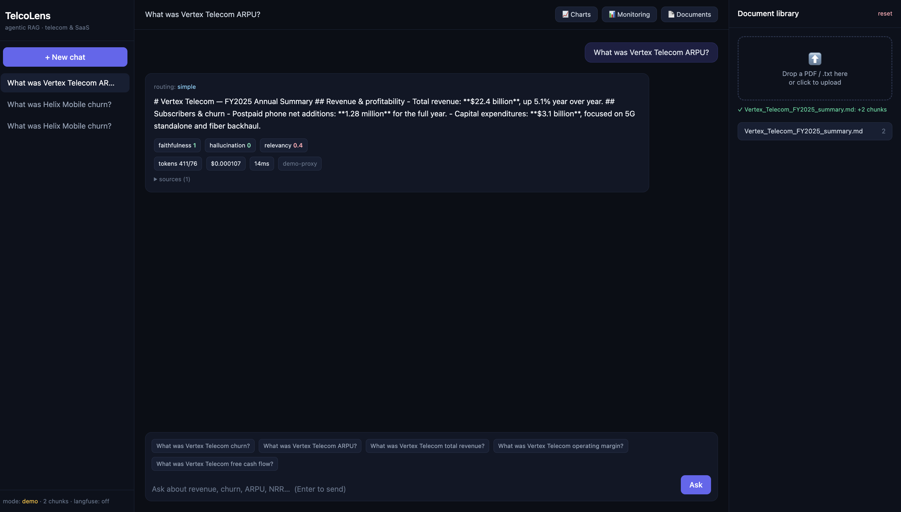

# TelcoLens — Agentic RAG Analyst for Telecom & SaaS Earnings

[](https://github.com/smruthidinesh/telcolens/actions/workflows/ci.yml)


An agentic Retrieval-Augmented Generation system that answers analytical questions over
telecom/SaaS earnings and operational documents (revenue, ARPU, churn, NRR, FCF). Built around a
**LangGraph** state machine that routes queries, retrieves and grades evidence, generates
grounded answers, and **evaluates every answer for faithfulness and cost**.

**▶ Live demo:** https://telcolens.onrender.com  ·  free tier, first load may take ~30s to wake.



### Highlights
Upload a document → ask in plain English → get a **grounded, cited** answer, with the agent's
reasoning shown step-by-step and every claim **clickable back to the source passage**.

- **Production retrieval:** hybrid dense + BM25 + RRF, with a reranking stage (not naive vector-only).
- **Adaptive:** long-context for whole small docs, hybrid RAG for large corpora.
- **Trustworthy:** inline `[n]` citations + source highlighting, plus per-answer faithfulness scoring.
- **Glass-box:** a live trace of every step (route → retrieve → rerank → grade → generate → evaluate).
- **Production discipline:** offline eval harness as a **CI quality gate**, cost/latency monitoring,
  Docker, tests, free **Groq** live mode (or fully offline demo mode).
- **Conversational + proactive:** remembers follow-ups; surfaces key insights on upload, unprompted.

> Designed to run **offline in demo mode** (no API keys) and scale to a live LLM pipeline by
> setting credentials. The agentic graph runs identically in both modes.

## What makes it more than a chatbot

- **Hybrid retrieval** — dense (semantic) + BM25 (lexical) search fused with **Reciprocal Rank
  Fusion**, so exact terms (names, figures) and meaning are both caught. See `app/vector_store.py`.
- **Reranking** — a larger candidate pool is re-scored (query-term coverage + phrase match) and
  trimmed to the best few; swappable for a neural cross-encoder. See `app/nodes/rerank.py`.
- **Inline citations + source highlighting** — answers cite sources as `[1] [2]`; click one to open
  the original document and see the cited passage **highlighted in place** (pdf.js). `app/nodes/generate.py`.
- **Glass-box trace** — every answer shows the agent's real steps (route → retrieve → rerank → grade →
  generate → evaluate) with the candidate scores. The reasoning is made visible, not hidden.
- **Proactive auto-insights** — on upload, the agent surfaces key findings + an anomaly unprompted.
  `app/insights.py`.
- **Agentic routing** — queries are triaged into `simple` (single retrieval) vs `complex`
  (decomposed into sub-queries with wider retrieval). See `app/nodes/route.py`.
- **Conversational memory** — follow-ups ("and the prior year?") are rewritten into standalone
  questions using the chat history before retrieval. See `app/memory.py`.
- **Relevance gate + retrieval loop** — weak retrieval triggers a widen-and-retry edge
  (`app/edges/decisions.py`) instead of answering on thin context.
- **Built-in evaluation** — every answer is scored for **faithfulness / hallucination risk**
  (Ragas in live mode, a grounding proxy in demo mode). `app/nodes/evaluate.py`.
- **Cost-awareness** — per-query token + USD + latency tracking, optionally streamed to
  **Langfuse**. `app/observability.py`.
- **Auto-charts** — metrics (churn, revenue, ARPU, NRR, margin, FCF) are extracted from the
  indexed documents and rendered as current-vs-prior comparison charts (Chart.js). `app/charts.py`.
- **Dynamic suggestions** — suggested questions are generated from the uploaded documents
  (company + detected metrics), not hardcoded. `app/suggest.py`.

## MLOps / production practices

- **Offline evaluation harness** — `scripts/evaluate.py` runs the full pipeline over a gold set
  (`eval/goldset.jsonl`) and reports aggregate accuracy / faithfulness / relevancy / cost. Doubles
  as a **CI regression gate** (`--fail-under`).
- **Monitoring** — every query's quality + cost is persisted (`app/metrics.py`); aggregates are
  exposed at `GET /metrics` (JSON) and `GET /metrics/prom` (Prometheus), and visualised in the
  UI's **Monitoring** panel.
- **Containerised** — `Dockerfile` + `docker-compose.yml` for one-command deploy.
- **Tested + CI** — `pytest` suite (`tests/`) and a GitHub Actions workflow that runs tests and
  the evaluation gate on every push.

```bash
python scripts/evaluate.py          # quality report → eval/report.json
docker compose up --build           # containerised, http://localhost:8077
pytest -q                           # run tests
```

## Architecture

```
START → route → retrieve → grade ─┬─(weak)→ expand → retrieve   (loop, capped)
                                  └─(ok)→ generate → evaluate → END
```

## Run it (demo mode, no keys)

```bash
cd telcolens
python3 -m venv .venv && source .venv/bin/activate
pip install -r requirements.txt
uvicorn app.main:app --reload --port 8000
```

Sample telecom/SaaS earnings are auto-ingested on first start. Then:

```bash
# simple lookup
curl -s localhost:8000/query -H 'content-type: application/json' \
  -d '{"question":"What was Aurora Telecom postpaid churn in Q3 2025?"}' | python3 -m json.tool

# complex / comparative (routes to decomposition)
curl -s localhost:8000/query -H 'content-type: application/json' \
  -d '{"question":"Compare churn trends and the drivers behind them at Aurora versus Nimbus"}' | python3 -m json.tool
```

API docs at `http://localhost:8000/docs`.

## Go live (full LLM + Ragas + Langfuse)

1. `cp .env.example .env`, set `TELCOLENS_DEMO=0` and `OPENAI_API_KEY`.
2. Uncomment the optional deps in `requirements.txt` and reinstall.
3. (Optional) add Langfuse keys for hosted cost/trace dashboards.

## Deploy (free)

The app is containerized and binds to `$PORT`, so it runs on any free Docker host. A
[`render.yaml`](render.yaml) blueprint is included. The app starts empty — upload your own
documents to begin. (Set `TELCOLENS_SEED=1` to pre-load the bundled sample docs instead.)

**Render (one-click):** New → Blueprint → connect this repo → Apply. Live at `https://<name>.onrender.com`.

> Free instances sleep after ~15 min idle (first request then takes ~30–60s to wake).

## Security & limitations

This is a single-user demo, hardened for the threats that matter at that scope:

- **Stored XSS prevented** — all uploaded document content, filenames, and user questions are
  HTML-escaped before rendering (`esc()` in the UI), so a malicious document can't inject script.
- **Upload limits** — uploads are capped at 10 MB and restricted to `.pdf` / `.txt` / `.md`.
- **Known limitation (by design):** the write endpoints (`/ingest`, `/reset`) are **unauthenticated**
  for local/demo use. A multi-user or public deployment should add auth (API key / OAuth), CSRF
  protection, and per-user document isolation.
- **State is in-process** (a single in-memory vector store). Production would externalize it to
  pgvector / Qdrant + object storage.

## Layout

```
app/
├── workflow.py      # LangGraph graph assembly
├── state.py         # shared agent state
├── nodes/           # route · retrieve · grade · generate · evaluate
├── edges/           # conditional retrieval-expansion logic
├── vector_store.py  # local cosine store (→ pgvector/Qdrant in prod)
├── llm.py           # LLM provider + offline extractive fallback
├── embeddings.py    # hashed offline embeddings + OpenAI provider
├── observability.py # Langfuse + local cost metrics
├── metrics.py       # per-query monitoring + /metrics aggregates
└── static/          # single-file web UI (chat, uploads, monitoring)
eval/                # gold set + evaluation report
scripts/evaluate.py  # offline evaluation harness / CI gate
tests/               # pytest suite
Dockerfile · docker-compose.yml · .github/workflows/ci.yml
```
